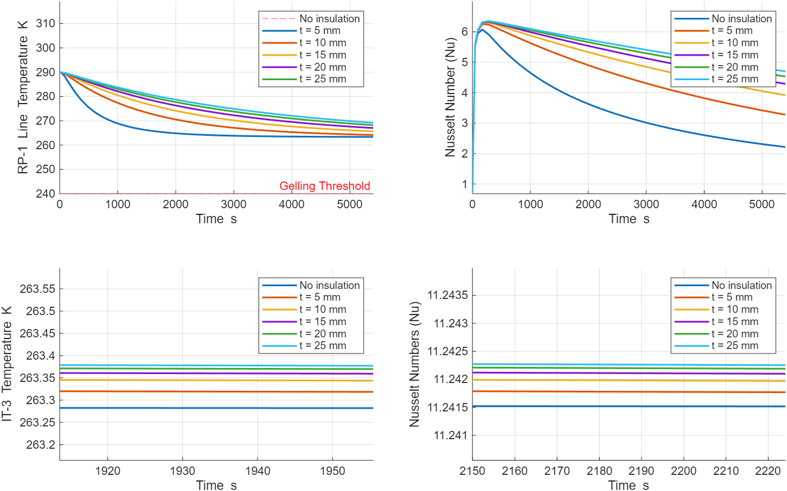

## Thermal Control System - 01 Fuel Inlet Line Thermal Analysis


### Background
TCS - The Yellow Jacket Space Program (YJSP) is developing Elytra, a space-bound liquid KeroLOX rocket. The Thermal Control System is responsible for maintaining all vehicle components within their operational temperature ranges during ground operations.

This repository documents the first-pass thermal analysis of the RP-1 Inlet Line for YJSP's Elytra vehicle, conducted as part of the Thermal Control System (TCS) responsible engineering effort. The analysis covers steady-state heating solutions and transient insulation trade studies for ground operations.

---

### Problem Statement

The Fuel Inlet Line in the rocket's powerhead has had a problematic past due to its complex thermal environment. RP-1 fuel is susceptible to gelling at and below 240K, which can restrict or completely block propellant flow through feed lines.

Problem Statement: Keep RP-1 in the Fuel Inlet Line above its gelling threshold of 240K for a 1.5 hour ground operations window pre-launch under worse-case thermal conditions in the powerhead region.

In this low fidelity 1D sim, the dominant heat transfer mechanisms include:
- Natural convection between powerhead air and Fuel Inlet Line, LOX Inlet Line, and outer tank wall interior
- Forced external convection between the outer tank wall exterior and the freestream
- Conduction through non-moving fluids, solid lines, and insulation

---

### Repo Structure
```
yjsp-tcs-rp1-thermal/
│
├── README.md
├── references/
│ └── Cebeci 1974.pdf
│
├── matlab/
│ ├── getNusselt_natural.m
│ ├── getNusselt_forced_internal.m
│ └── getNusselt_forced_external.m
│
├── simulink/
│ ├── st_transient_ODE1.slx
│ ├── st_transient.slx
| └── st_transient_parameters.m
│
└── figures/
  ├── st_steady_preTRN.png
  ├── st_transient_ODE1.png
  └── st_transient.png
```

---

### Assumptions / Limitations
**Modeling Assumptions:**
- Lumped system approximation - RP-1 fluid is given a fully developed profile and geometric symmetry, meaning that the fluid and its line are treated as a single uniform temperature node changing only as a function of time.
- Fluid properties are evaluated at the film temperature, and held constant across simulations. No properties are a property of temperature.
- LOX temperature is held constant at 90K, a buffer assumed due to phase change

**Modeling Limitations:**
- 1D lumped model cannot resolve local temperature gradients.
- Signification radiation effects excluded.
- Structural conduction through brackets, mounts, and adjacent structures excluded.
- Cannot take temperature as a function of x, y, and z or other position coordinates.

---

### Results
Full figures available in ['figures/'](figures/).



Upon coupling the temperature of the fuel inlet line and the temperature of the powerhead air, it becomes clear that higher fidelity, multi-dimensional transient heat transfer and fluid analysis is necessary. Results of this 1D sim show no temperature issues, so more complexity, elements, and modes/paths of heat transfer must be introduced.

---

### Path Forward
**Near Term**
- [ ] Obtain confirmed pip material callout from CAD to replace -- PLACEHOLDERS --.
- [ ] Add radiation heat transfer effects between Fuel and LOX inlet lines and other significant regions.

**Medium Term**
- [ ] ANSYS Mechanical Transient Thermal - geometry-resolved model of the Fuel inlet line and surrounding powerhead structures, captures temperature gradients and fitting/mount conduction paths.
- [ ] Validate and build on Simulink Results against ANSYS at matched boundary conditions.

**Long Term**
- [ ] ANSYS Fluent conjugate heat transfer - full powerhead thermal environment including natural convection flow fields, radiation effects, and passthrough / other complex geometries.
- [ ] Thermal instrumentation on Component Test Stand (CTS) and full system validation and qualification testing for experimental validation of model predictions.

---

### References
- Cengel, Y.A., & Ghajar, A. J. *Heat and Mass Transfer* McGraw-Hill.
- Cebeci, T. (1974). *Free Convective Heat Transfer From Slender Cylinders Subject to Uniform Wall Heat Flux*. ['references/Cebeci1974.pdf'](references/Cebeci1974.pdf)

---

### Author
Aryan Yenni - Thermal Control System Responsible Engineer,
Yellow Jacket Space Program, Georgia Institute of Technology
